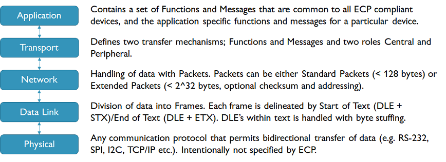
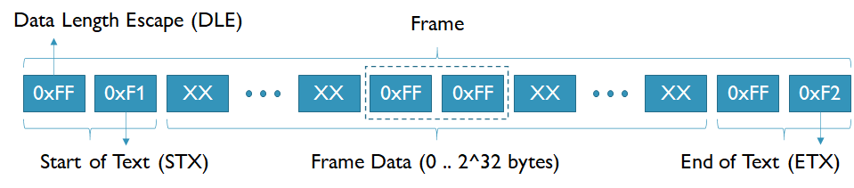
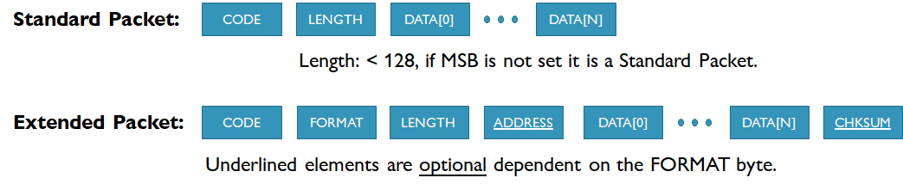
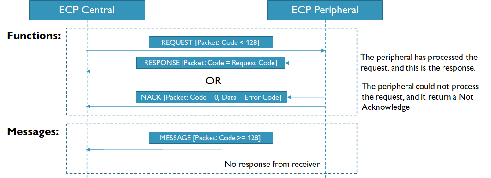
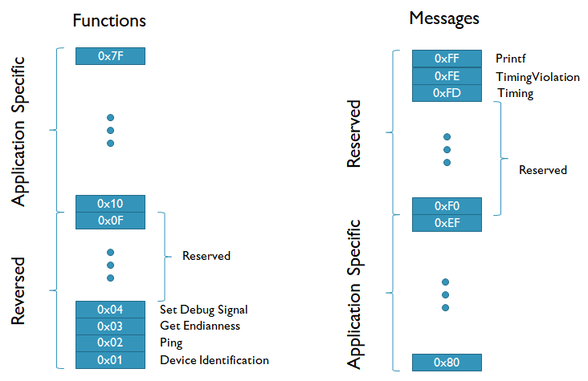

# Embedded Communication Protocol (ECP)

The ECP communications protocol is intended to be a scalable communication protocol for embedded software running on relatively modest hardware, from simple 8-bit processors such as the AVR microprocessors to more complex and powerful 32-bit ARM processors such as the PSoC chips from Cypress.

The protocol is scalable in the sense that it is possible to omit features of the protocol from an embedded software implementation that does not have the memory and/or the processing power to include it. The full protocol includes addressing for multiple devices, checksum of for validation of data integrity, two types of communication transactions (functions and messages), and the possibility of transmitting data of up to theoretically 4GB in size in a single transaction.

In line with philosophy of a scalable protocol, the protocol does not impose any requirements on the actual low level data communication protocol as long as it permits at least simplex/half duplex transmission of data. The protocol can be RS232, I2C, SPI, etc. However, if the implementation is restricted to a simplex transmission data then only functions can be implemented by the protocol, as messages requires full duplex transmission of data.

## Overview

The protocol is divided into the following layers:

## Protocol description

### Data Link Layer

The data link layer is responsible for implement frames, which permits chunks of data to be separated from each other. This is performed with framing codes (Start of Text [STX]) and (End of Text [ETX]) that is inserted in between each frame in the data stream, as shown in the figure before.

To separate STX [0xF1], and ETX [0xF2] data bytes from data bytes with the same values that are part of the data being transmitted, each STX/ETX is preceded with a Data Length Escape (DLE) [0xFF] byte. This DLE byte can then be used by the receiving software to distinguish between whether the 0xF1/0xF2 is either the beginning or end of a frame or whether it is part of the data being transmitted in the frame. 

However, the DLE/STX and DLE/ETX combinations may also occur in the data being transmitted. Byte stuffing is used to distinguish between a DLE/STX or DLE/STX that is framing or which is part of the data being transmitted. This is done by for each DLE that is part of the data an extra DLE is inserted. Consequently, when the data is reived if a STX or ETX is preceded by an even number of DLE’s then it is part of the data and part of the framing of a frame. The extra DLE’s is discarded when the data is received.
The advantage of this approach is that it is possible to transfer arbitrary binary data with the ECP protocol, the disadvantage is that the size of the frames in dependent on its data content and it makes it more challenging to calculate maximal data transfer rates for the protocol.

### Network Layer

The network layer is responsible for encoding data into packet. A packet is a chunk of data with associated meta information. The protocol allows for the following information to encoded into a packet:

* CODE: Identifies the packet and is used by the Transport layer to implement two types of transfer mechanisms; functions, and messages.
* LENGTH: The length of the data that is enclosed with the packet.
* ADDRESS (Optional): The address of the device to which the packet should be sent. This is used in composite devices that is organised in a tree structure, so that packets can be routed to the correct device.
* CHKSUM (Optional): This is a checksum that is calculated on all the bytes in the packet before the CHKSUM byte.

The format of a packet is shown in the figure below:

As shown in the figure the protocol defines two types of packets: Standard Packets, and Extended Packets.

#### Packet types

As shown in the figure if the second byte in the packet is less than 128 then the packet is a Standard Packet, and in this case the second bytes encode the length of the data in the packet. Standard packets can only have a code and cannot contain an address or a checksum. If the data in a packet exceeds 127 bytes, it requires an address, or a checksum then it must be encoded as an Extended Packet.

In that case the MSB of the second byte in the packet must be set to 1, and in that case the second byte is a FORMAT byte that specifies the format of the extended packet.

This FORMAT byte has the following encoding:

| Bit  | Name | Specification |
|------|------|---------------|
| 7    | EXT  | Extended Packet; 0) Standard Packet, 1) Extended Packet. |
| 5..6 | RESERVED | Reserved for future use, invalid if different from zero. |
| 4   | ADDRESS | 0: No address, 1: Address enabled |
| 2..3 | CHKSUM | 0: No checksum, 1: ADDITIVE, 2): CRC8 CCIT, 3): Invalid |
| 0..1 | LENGTH | 0: Length (UINT8), 1: Length (UINT16), 2: Length (UIN32), 3: Invalid |

#### Device addressing

The protocol support composite devices as shown in the figure below:

A composite device consists of multiple microprocessors that each implements an ECP peripheral and potentially several ECP centrals, one ECP central for each ECP peripheral further down the tree. In the figure above the embedded system consists of all the nodes below the top one, which is typically a PC communicating with the embedded software.

When a packet is received from an ECP Central, it is the responsibility of the receiving ECP Peripheral to check the address of the packet and to resend it to the correct ECP Peripheral further down the tree, and if needed resend the response packet further up the tree when the packet has been processed by its intended recipient. 

The routing of packets will be further described in the Transport layer when Functions are defined.

### Transport Layer

The transport layer is responsible for implementing two types of transactions:

1. Functions: are transaction that takes the form of a Request that is sent from an ECP Central to an ECP Peripheral, and a Response that contains the result of the Request, which is sent from the receiving ECP Peripheral to the ECP Central that initiated the function.
2. Messages: are transactions that consists of a packet that can be sent both from an ECP Central or an ECP Peripheral. Message are unacknowledged by the recipient.

The flow of communication with functions and messages is illustrated in the figure below: 

A recipient differentiates between functions and messages based on the CODE of the packet. If the CODE is lower than 128 (i.e. the MSB is not set) then the packet is belonging to a function, otherwise it is a message.

#### Functions

A function consists of a Request packet that is always sent from an ECP Central to a ECP Peripheral. The Request packet can contain data with the input to the function to execute on ECP Peripheral. The ECP Peripheral then responds with either a Response or a Not Acknowledge (NACK).

If the ECP Peripheral successfully executed the Request, then it will respond with a Response containing the results of the function execution. The Response has the same code and address as the Request that initiated it.

However, if for some reason the ECP Peripheral was not able to execute the function then it will respond with a NACK packet. The NACK packet has a CODE of 0x00 and a single data byte with an error code for why it was unable to execute the function. The ECP protocol defines the following standard error codes that must be implemented by all ECP compliant devices:

| Code | Specification |
|---|----|
| 0x00 | No error |
| 0x01 | Unknown function |
| 0x02 | Invalid content |
| 0xFF | Dispath error |

An ECP implementation can defines as many extra error codes as required for its application.

For the current ECP design to work the following must be guaranteed of a system implementing the ECP protocol:

1. Functions must be guaranteed to either execute within a given time out or respond immediately with a NACK. Consequently, functions are with the ECP protocol not intended for lengthy operations. If an operation is lengthy then it must be broken down into a function that initiate it and a function that poll for its completion and/or the dispatch of a Message by the ECP peripheral.
2. One and only one ECP function can be active at any time, a new ECP function must not be initiated by the ECP Central before either a Response or a NACK is received, or the timeout has occurred.

If these conditions are not meet bad things is likely to happen.

#### Messages

Messages consists of a single Packet that is either sent from the ECP Peripheral or the ECP Peripheral.

They are unacknowledged and consequently they may be lost without the sender being made aware of that. They should be used for information that is transmitted repeatedly, so that if a message is lost the error will be recovered the next time the message is sent.

Because the recipient can use the CODE to differentiate between Messages and the Response to an active Function, Messages can be sent at any time in between the execution of Functions.

#### Addressing and routing of functions and messages

Work in progress.

### Application Layer

## Getting started

Work in progress.

## Using the .NET Library

Work in progress.

## Implementing the ECP protocol on target

For a reference firmware that implement an ECP Peripheral on a microprocessor (ATmega2560 / Arduino Mega) see:

[ECP.Firmware](https://github.com/Inventors-Way/Firmware.ECP)

